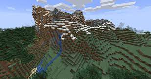
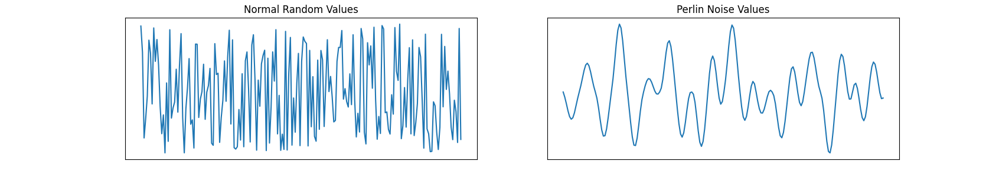
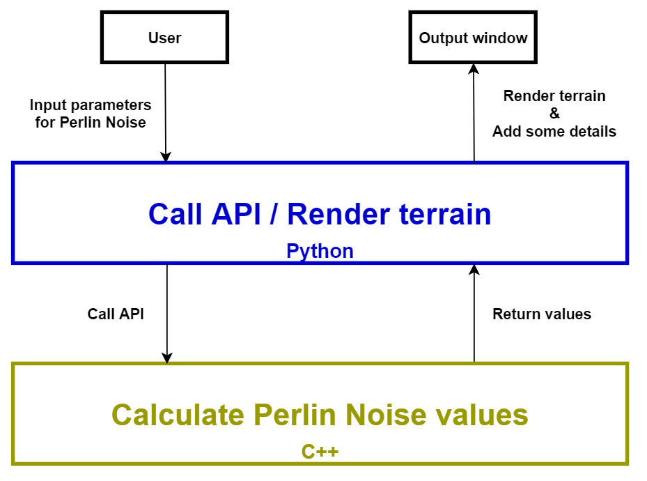

# Procedural Terrain Generation #

Procedurally generate random terrain with **[Perlin noise](https://en.wikipedia.org/wiki/Perlin_noise)**.

## Basic Information ##

GitHub repository : [https://github.com/B10732009/procedural-terrain-generation](https://github.com/B10732009/procedural-terrain-generation)

**[Procedural Generation](https://en.wikipedia.org/wiki/Procedural_generation)** is a method of **creating data algorithmically** as opposed to manually, typically through a combination of human-generated assets and algorithms coupled with computer-generated randomness and processing power. 

In video games,  **Procedural Terrain Generation** is very useful where you want generate natural terrain (caves, hills, rivers, etc.) that has a smooth feel, but is still random.

<p style="text-align: center;">
    <br>
    Minecraft, a 3D graphic game <br>that has many kinds of terrain generation.
</p>

## Problem to Solve ##

**Perlin Noise** is very pouplar an algorithm for procedural generation developed by Ken Perlin in 1983. It can be used for any sort of wave-like, undulating material, texture, or terrain. 

Compared with just some random values, Perlin Noise can generate values very smoothly and continuously, which looks more realistic in terrain generation. 

The image below shows the difference between normal random values and perlin noise.

<p style="text-align: center;">
    
</p>

In this project, I am going to implement a set of API (for C++ and Python) of the Perlin Noise algorithm in 1D, 2D, and 3D (if time is enough), and use these API to render some terrain.

## Prospective Users ##

Anyone who wants to simulate random terrain or uses Perlin Noise for application.

## System Architecture ##

- Use `C++` to implement algorithm.
- Use `Pybind11` to wrap C++ functions for Python.
- Use `Python` to render the terrain with these APIs (with some rendering tools).

<p style="text-align: center;">
    
</p>

## API Description ##

A set of API for C++ and Python, respectively.

```cpp
class PerlinNoise
{
private:
    int seed;
    std::vector<std::vector<double>> data;    
public:
    int getSeed() const;
    double getNoise(int _x) const;
    std::vector<std::vector<double>> getNoises() const;
};
```

## Engineering Infrastructure ##

- Automatic build system : GNU Make
- Version control : git
- Testing framework : pytest
- Documentation : README in the github repository 

## Schedule ##

- Week 1 (4/10)
    - Study the algorithm and related knowledge.
- Week 2 (4/17)
    - Implement the 1D perlin noise algorithm.
- Week 3 (4/24)
    - Implement the 2D perlin noise algorithm.
- Week 4 (5/01)
    - Implement the 3D perlin noise algorithm (if time is enough).
    - Code refactoring.
- Week 5 (5/08)
    - Setup python rendering environment.
    - Try to render the terrain.
- Week 6 (5/15)
    - Add details to the terrain.
        - Color
        - Textures
        - Falloff map
- Week 7 (5/22)
    - Write test.
    - Code refactoring.
- Week 8 (5/29)
    - Write document & prepare for presentation. 

## References ##

- [Procedural Generation (wikipedia)](https://en.wikipedia.org/wiki/Procedural_generation)
- [Perlin Noise (wikipedia)](https://en.wikipedia.org/wiki/Perlin_noise)
- [Minecraft terrain generation in a nutshell (YouTube)](https://www.youtube.com/watch?v=CSa5O6knuwI)
- [Procedural Terrain Generation (YouTube)](https://www.youtube.com/playlist?list=PLFt_AvWsXl0eBW2EiBtl_sxmDtSgZBxB3)
- [Understanding Perlin Noise (article)](https://adrianb.io/2014/08/09/perlinnoise.html)
- [Improving Noise by Ken Perlin](https://mrl.cs.nyu.edu/~perlin/paper445.pdf)